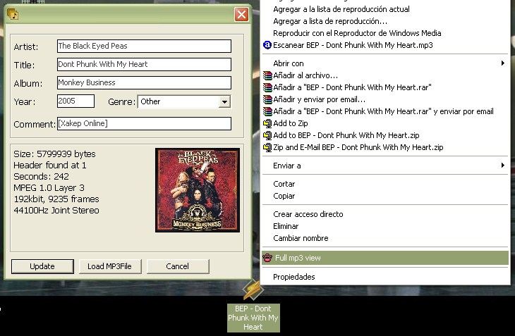



## Best Mp3 Property Sheet

### Description

Read mp3 tag and download his cover picture from internet based in artist name and album name.

Interactivity with explorer context menu, whe you right click over a mp3 file show the option to read his info.

How to use it:

1.-open "Helper_Context" proyect and compile to DLL

2.-open "musicProp" proyect an compile to .exe

3.-go to "Utility Register" folder and open "Register_Handler" proyect an run it

4.-go for any mp3, right click over it, and "wha-la", show all mp3 tag info and his cover-image was found on internet
 
### More Info
 

             |
---                |---
**Submitted On**   |2006-02-03 15:40:46
**By**             |[Int\_21](https://github.com/Planet-Source-Code/PSCIndex/blob/master/ByAuthor/int-21.md)
**Level**          |Advanced
**User Rating**    |3.7 (11 globes from 3 users)
**Compatibility**  |VB 6\.0
**Category**       |[Sound/MP3](https://github.com/Planet-Source-Code/PSCIndex/blob/master/ByCategory/sound-mp3__1-45.md)
**World**          |[Visual Basic](https://github.com/Planet-Source-Code/PSCIndex/blob/master/ByWorld/visual-basic.md)
**Archive File**   |[Best\_Mp3\_P196972232006\.zip](https://github.com/Planet-Source-Code/int-21-best-mp3-property-sheet__1-64213/archive/master.zip)

